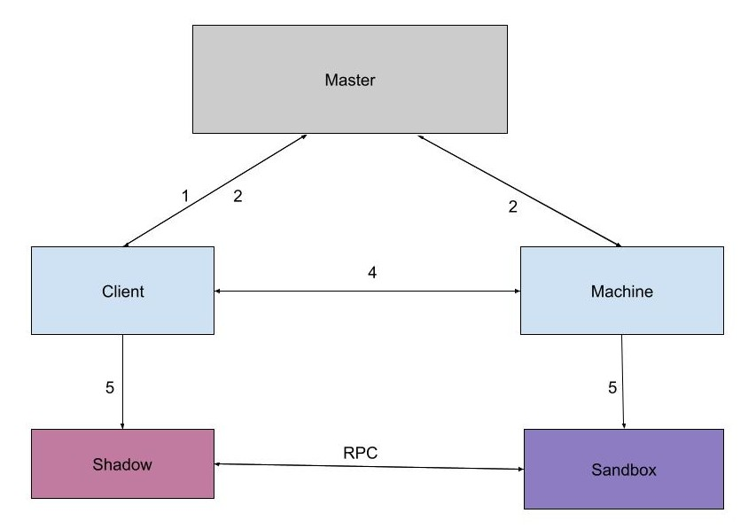

# CyMart

A platform to buy/sell computing cyles of idle CPUs. In general, most of the time CPU cores in a
Personal Computer (PC) are idle and almost using single core, despite being multi-core.
This hardware can be used for both seller and buyer’s benefit. Sellers can get profit from
its unused CPU resources, and buyers need not to purchase new hardware for trivial tasks.
In addition, users can distribute the compute-heavy tasks to many
machines, execute them in parallel, and aggregate the final results.

## Architecture

Most of the high-level design for this project is inspired from the [Condor](https://dl.acm.org/doi/10.5555/1064323.1064336) project and I modified
the architecture according to the required complexity. The system contains three major components.


#### Master

The master node is the primary module for the system. It handles the assignment/match-
making of a job with a resource. At present, it uses a round-robin algorithm to assign the
resource. In later updates, I’ll modify the resource assignment algorithm that consider more
properties such as a user’s preferences for a resource and a resource’s preference for a set of
users during allocation.


#### Resource

The machine is a compute resource that is matched with a job. The owner of the machine
registers it to the system by placing a `machine ad` to the system. When the machine
completes its assigned job, the owner of the machine is free to take it back.

```
MachineAD {
        id = 654,
        owner = "Alice",
        machineAddress = "10.25.45.002",
        memory = "16GB",
        OS = "Linux",
        architecture = "intel",
        processor = "i9",
        cores = 8,
        availalbleFor="6 hours"
    }
```

#### Client

The client/user is an entity that is requesting compute resources. The client submits a
request `job ad` to the master and gets the address of the resource machine to connect.

```
JobAD {
        id = 2543,
        user = "Bob",
        clientAddress = "10.58.07.15",
        computeTime = "30 minutes",
        memoryNeed = "8 GB",
        OS = "Linux",
        architecture = "intel",
        processor = "i9",
        cores = 8,
        needCheckpoints = "yes"
        scripts = 1
    }
```

#### Workflow

1. client submits a job ad to the system
2. master assigns a resource for the job
3. master sends the match object containing the client and the machine.
4. resource connects with the client and gets the job script.
5. resource initializes sandbox environment and client initializes shadow environment.
6. resource completes the task and sends the result to the client.
7. resource deletes the job script and waits for another job



## Dependencies

1. Java SE 16
2. Maven
3. Apache ZooKeeper
4. Apache Commons Lang
5. Log4J

Maven automatically installs the above dependencies during Maven build.

## Installation

1. Download the latest repository from git.
2. Open the project in any IDE (IntelliJ preferred).
3. Run maven build.
4. Run SetupScript.java to setup znodes in ZooKeeper server.

## Usage
1. Start ZooKeeper server on port 8000
2. Run `Master.java`, `Resource.java` and `Client.java` on different machines.
3. On a standalone environment, all three programs can be run on the same machine.
4. For client, the output of the task and the billing information is stored 
in `output.txt` in the project root folder.


## Note

Java Security Manager is deprecated in the recent releases. 
Due to lack of up-to-date documentation, efficiently implementing
and integrating a secured sandbox on top of JVM has become challenge.
At present, the project is working as expected, but without a 
security manager to guard the I/O calls. For the next release,
I'm writing a filter that filters all the I/O calls and replaces with
the remote method calls to the shadow environment of the user.
